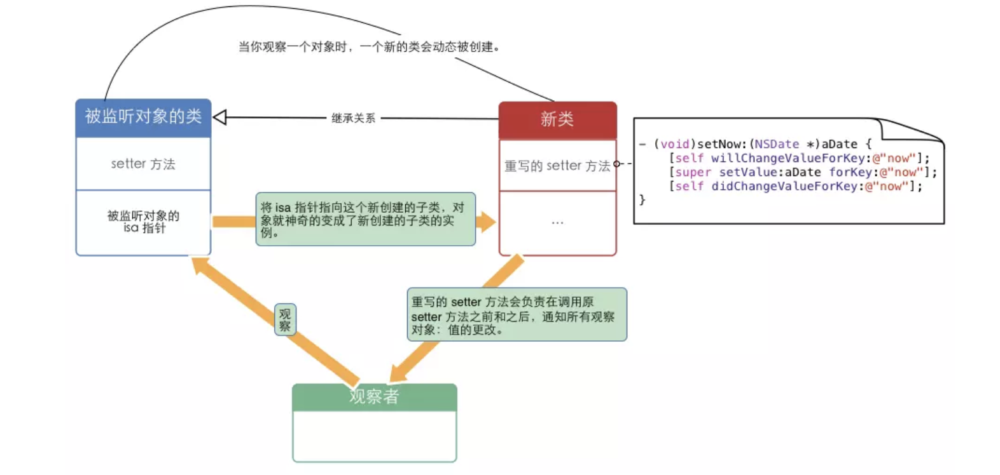
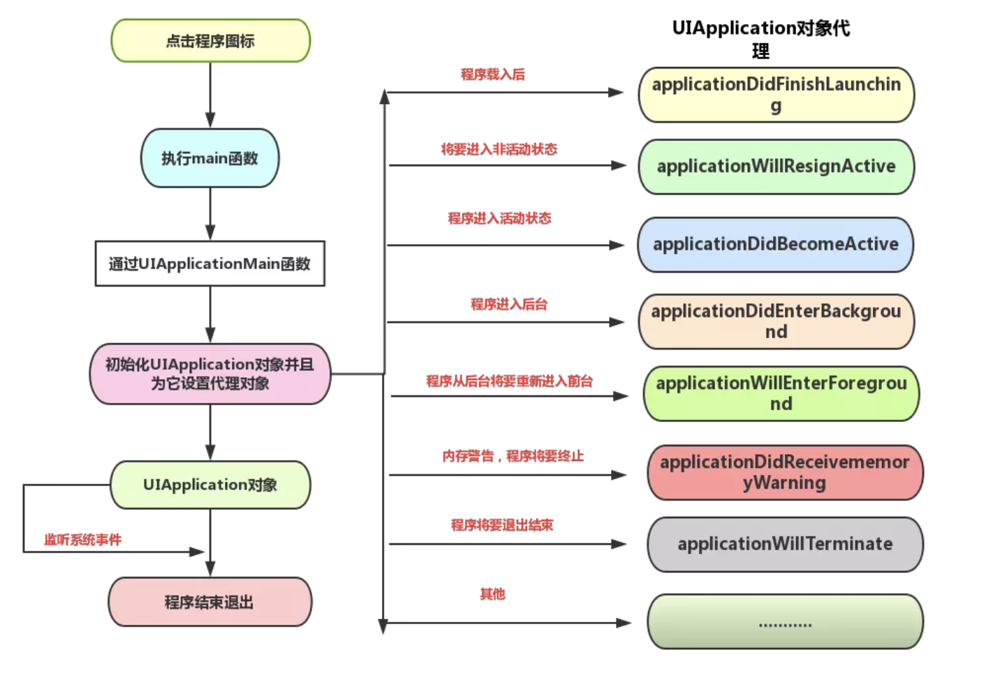
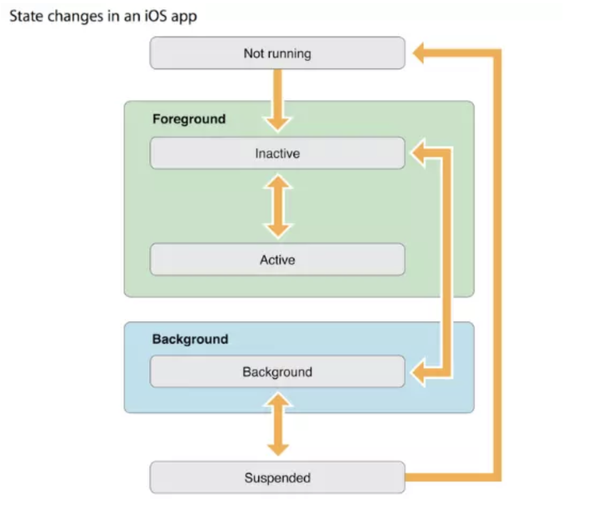

# Objective-C

简称OC，在C语言的基础上添加了**面对对象**的特性。

## 了解OC

OC的起源，在OC中频繁的使用[]方括号，是因为在OC中存在着特殊的**消息机制**，而不是**函数调用**。

**消息机制**：其运行时，不管是否多态，总是在运行时才会去查找所要执行的方法，实际上编译器不会去关心接受对象是什么类型，因为接受消息的对象问题也要在运行时考虑，这个过程是**动态绑定**。

* OC中所有重要工作都由**运行时组件**而非编译器完成。

### OC中的栈和堆

在OC中会经常声明一个NSString* str = @"hello world";这样的语句

1. 声明的是一个指向NSString* 的指针而OC中的所有对象都要这样声明

2. 在内存中的栈区声明了一个NSString* 型的指针

3. 在内存中的堆中分配的NSString对象

4. 分配在栈中的保存变量的内存会自动清理

5. 分配在堆中的内存要手动管理-但是OC将这部分抽象出来形成了引用计数

有时候会遇到定义中不含* 的变量他们可能会使用栈空间，例如CoreGraphics框架中的CGRect等。

### OC中的头文件操作

* 在OC中的有时候使用一个Person类的文件的时候，不需要知道Person的全部细节，只要知道有这个类就行了这个时候只用在头文件中声明@class Person 就可以告诉编译器————————这样的情况叫前向声明。

* 而在实现文件中，如果要知道其全部细节，则要在实现文件中加入头文件。

> 向前声明解决了两个类相互引用的问题，要引用会在各个头文件中引入了对方的文件。而使用import虽然不会像include一样导致死循环，但是意味着有一个无法正确编译，也降低了类之间的耦合.

## KVC&&KVO

### KVC的原理

KVC的底层实现

#### set

1. 程序先调用set:属性名设置，然后代码通过setter方法完成设置
2. 如果没有找到setter方法，KVC会检查`+(BOOL)accessInstanceVariablesDirectly`方法来检查有没返回yes
   1. 默认返回yes到第3步
   2. 如果在类中重写类方法直接跳到第5步
3. 在类中通过`_key`来访问
4. 还是不行的话通过`_iskey`来访问
5. 最后调用`setValue：forUndefinedKey`曝出异常

#### get

1. 如果是BOOL或者int类型会包装成NSNumber对象
2. KVO也会检查`+(BOOL)accessInstanceVariablesDirectly`
3. 最后还是调用`valueForUndefinedKey:`返回一个异常

### KVC处理nil异常

通常就由`setNilValueForKey`来抛出空异常
所以解决方法：**重写这个方法**

### KVO的原理

KVO 是通过 isa-swizzling 实现的。
基本的流程就是编译器自动为被观察对象创造一个派生类，并将被观察对象的isa 指向这个派生类。如果用户注册了对某此目标对象的某一个属性的观察，那么此派生类会重写这个方法，并在其中添加进行通知的代码。Objective-C 在发送消息的时候，会通过 isa 指针找到当前对象所属的类对象。而类对象中保存着当前对象的实例方法，因此在向此对象发送消息时候，实际上是发送到了派生类对象的方法。由于编译器对派生类的方法进行了 override，并添加了通知代码，因此会向注册的对象发送通知。注意派生类只重写注册了观察者的属性方法。

## 实例方法和类方法的区别

### 类方法（工厂方法）

在OC中类定义方法时以 + 开头的方法，又称为静态方法

1. 静态方法常驻内存，实例方法不是，所以静态方法效率高但占内存
2. 静态方法在堆上分配内存
3. 静态方法是静态绑定到子类中

### 什么时候用类方法

1. 一般使用频繁的方法用静态方法，用的少的方法用动态的。静态的速度快，占内存。动态的速度相对慢些，但调用完后，立即释放类，可以节省内存

## 类方法中的load和initialize

### load

当类被引用进项目的时候就会执行load函数(在main函数开始执行之前）,与这个类是否被用到无关,每个类的load函数只会自动调用一次.由于load函数是系统自动加载的，因此不需要调用父类的load函数，否则父类的load函数会多次执行。

1. 当父类和子类都实现load函数时,父类的load方法执行顺序要优先于子类
2. 当子类未实现load方法时,不会调用父类load方法
3. **类中的load方法执行顺序要优先于类别(Category)**
4. **当有多个类别(Category)都实现了load方法,这几个load方法都会执行**,但执行顺序不确定(其执行顺序与类别在Compile Sources中出现的顺序一致)
5. 当然当有多个不同的类的时候,每个类load 执行顺序与其在Compile Sources出现的顺序一致

### load使用情况

由于调用load方法时的环境很不安全(其他类可能还没加载完成,运行环境不安全)，我们应该尽量减少load方法的逻辑。另一个原因是load方法是线程安全的，它内部使用了锁，所以我们应该避免线程阻塞在load方法中

1. Method swizzling
2. runtime方法

### initalize

initialize在类或者其子类的第一个方法被调用前调用。即使类文件被引用进项目,但是没有使用,initialize不会被调用。由于是系统自动调用，也不需要再调用  [super initialize] ，否则父类的initialize会被多次执行。假如这个类放到代码中，而这段代码并没有被执行，这个函数是不会被执行的。

1.父类的initialize方法会比子类先执行
2.当子类未实现initialize方法时,会调用父类initialize方法,子类实现initialize方法时,会覆盖父类initialize方法.
3.当有多个Category都实现了initialize方法,会覆盖类中的方法,只执行一个(会执行Compile Sources 列表中最后一个Category 的initialize方法)

### initalize使用情况

initialize方法主要用来对一些不方便在编译期初始化的对象进行赋值。比如NSMutableArray这种类型的实例化依赖于runtime的消息发送，所以显然无法在编译器初始化

## 程序的生命周期

1. 首先进入main函数
2. 执行UIApplicationMain函数
3. 初始化UIApplication对象并为他设置代理对象
   1. 即在Appdelegate中的方法
4. UIApplication对象监听系统事件
5. 最后退出

