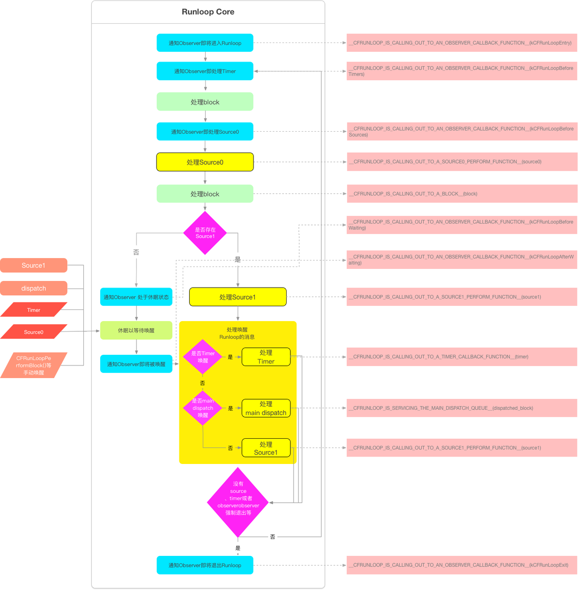

# RunLoop

* 保证程序的持续运行
* 处理App中的各种时间
* 节省CPU资源，提高程序性能
* 相当于死循环，保持程序的持续运行
* main函数中的RunLoop
* UIApplicationMain函数内部启动了一个RunLoop，该函数返回一个int类型的值
* 这个默认启动的RunLoop和主线程相关



## RunLoop对象

1. OC中的NSRunLoop
   1. 基于CFRunLoopRef的封装
   2. 线程不安全
2. C中的CFRunLoopRef
   1. 线程安全
   2. 基于pthread_t来管理的
3. 他们是等价的可以相互转化其实NSRunLoop就是对CFRunLoopRef的封装

## RunLoop的唤起和挂起

通过mach port来唤起和挂起

### RunLoop和线程

1. RunLoop和线程的关系：一个RunLoop对应一条唯一的线程
   1. 以字典存储起来的RunLoop对应一个唯一的线程，key对应的是pthread_t Value对应的是RunLoop
   2. RunLoop的创建：主线程的RunLoop已经创建好了，子线程的RunLoop要自己创建
   3. RunLoop的生命周期：在第一次获取是创建，在线程结束时，销毁

```objc
// 全局的Dictionary，key 是 pthread_t， value 是 CFRunLoopRef
static CFMutableDictionaryRef loopsDic;
// 访问 loopsDic 时的锁
static CFSpinLock_t loopsLock;
// 获取一个 pthread 对应的 RunLoop。
CFRunLoopRef _CFRunLoopGet(pthread_t thread) {
OSSpinLockLock(&loopsLock);
if (!loopsDic) {
// 第一次进入时，初始化全局Dic，并先为主线程创建一个 RunLoop。
loopsDic = CFDictionaryCreateMutable();
CFRunLoopRef mainLoop = _CFRunLoopCreate();
CFDictionarySetValue(loopsDic, pthread_main_thread_np(), mainLoop);
}

// 直接从 Dictionary 里获取。

CFRunLoopRef loop = CFDictionaryGetValue(loopsDic, thread));
if (!loop) {
// 取不到时，创建一个
loop = _CFRunLoopCreate();
CFDictionarySetValue(loopsDic, thread, loop);
// 注册一个回调，当线程销毁时，顺便也销毁其对应的 RunLoop。
_CFSetTSD(..., thread, loop, __CFFinalizeRunLoop);
}
OSSpinLockUnLock(&loopsLock);
return loop;
}

CFRunLoopRef CFRunLoopGetMain() {
return _CFRunLoopGet(pthread_main_thread_np());
}
CFRunLoopRef CFRunLoopGetCurrent() {
return _CFRunLoopGet(pthread_self());
}  
```

### OC获取当前RunLoop对象

`NSRunLoop* runloop = [NSRunLoop currentRunLoop];`
如果不做任何操作run这个RunLoop的话会自己退出

### C获取当前RunLoop对象

`CFRunLoopRef* currentLoop = CFRunLoopGetCurrent();`

### 创建RunLoop

1. 开一个子线程创建RunLoop，不是通过alloc或者init创建的，而是直接通过调用currentRunLoop方法创建的。
   1. currentRunLoop这个方法是懒加载的在调用的时候会创建并保存
   2. 在子线程中如果不主动获取RunLoop的话，子线程内部是不会创建RunLoop的

### RunLoop的运行原理


### **5个相关的类**

#### CFRunLoopRef

通过currentRunLoop懒加载RunLoop之后[RunLoop run];来开启RunLoop但是开启之后会选择一个运行模式并且检查里面的timer|source是否为空若**为空**直接**退出**

#### CFRunLoopModeRef（运行模式）

一个RunLoop要想运行起来，它的内部必须要有一个非空mode，里面有source\observer\timer至少有一个，是APP滑动流畅的关键（有个专门的mode**trackingMode**）

RunLoop中的Mode

1. kCFDefaultRunLoopMode
   1. App的默认Mode，通常主线程是在这个Mode下运行
2. UITrackingRunLoopMode
   1. 界面跟踪Mode，用于ScrollView追踪触摸滑动，保证界面滑动时不受其他Mode影响
3. UIInitializationRunLoopMode
   1. 在刚启动App时第进入的第一个Mode，启动完成后就不再使用
4. GSEventReceiveRunLoopMode
   1. 接受系统事件的内部Mode，通常用不到
5. kCFRunLoopCommonModes
   1. 这是一个占位用的Mode，不是一种真正的Mode
   2. 一个 Mode 可以将自己标记为"Common"属性（通过将其 ModeName 添加到 RunLoop 的 "commonModes" 中）。每当 RunLoop 的内容发生变化时，RunLoop 都会自动将 _commonModeItems 里的 Source/Observer/Timer 同步到具有 "Common" 标记的所有Mode里主线程的 RunLoop 里有 kCFRunLoopDefaultMode 和 UITrackingRunLoopMode，这两个Mode都已经被标记为"Common"属性。

每次调用RunLoop的时候只能指定其中一个Mode，如果更换Mode的时候只能退出，在重新指定一个RunLoop进入
    * 为了分隔开不同Mode的Time|Source|Observer

##### NSTimer添加到RunLoop的过程

每次添加NSTimer的时候是通过commonMode来添加的`[[NSRunLoop mainRunLoop] addTimer:timer forMode:NSRunLoopCommonModes];`，但是他实际并不是一个Mode，而是系统将这个Timer添加到了系统RunLoop的commonModeItems中了，commonModeItems 会被 RunLoop 自动更新到所有具有"Common"属性的 Mode 里去。
这一步其实是系统帮我们将Timer加到了kCFRunLoopDefaultMode和UITrackingRunLoopMode中。

#### CFRunLoopSourceRef （要处理的事件源）

比如外部的触摸，点击事件和系统内部进程间的通信等。类似于一个protocal，只要实现了这个就能在RunLoop中运行

1. source0
   1. source0是App内部事件，由App自己管理的UIEvent、CFSocket都是source0。当一个source0事件准备执行的时候，必须要先把它标记为signal状态
   2. source0是非基于Port的。只包含了一个回调（函数指针），它并不能主动触发事件。使用时，你需要先调用 CFRunLoopSourceSignal(source)，将这个 Source 标记为待处理，然后手动调用 CFRunLoopWakeUp(runloop) 来唤醒 RunLoop，让其处理这个事件
2. source1
   1. source1由RunLoop和内核管理，source1带有mach_port_t，可以接收内核消息并触发回调
   2. Source1除了包含回调指针外包含一个**mach port**，Source1可以监听系统端口和通过内核和其他线程通信，接收、分发系统事件，它能够主动唤醒RunLoop(由操作系统内核进行管理，例如CFMessagePort消息)
      1. **mach port**很重要，轻量级的进程间通信的方法--封装--》NSPort

#### CFRunloopTimerRef （Timer事件）

监听RunLoop的状态需要添加到RunLoop中才有效果，会受到mode的影响

#### CFRunLoopObserverRef （RunLoop的观察者）

可以监听当前的RunLoop的状态的改变
只能使用C语言的函数创建观察者

```objc
CFRunLoopObserverRef observer = CFRunLoopObserverCreateWithHandler(CFAllocatorGetDefault(), 0, YES, 0, ^(CFRunLoopObserverRef observer, CFRunLoopActivity activity) {
/*
typedef CF_OPTIONS(CFOptionFlags, CFRunLoopActivity) {
kCFRunLoopEntry = (1UL << 0),
kCFRunLoopBeforeTimers = (1UL << 1),
kCFRunLoopBeforeSources = (1UL << 2),
kCFRunLoopBeforeWaiting = (1UL << 5),
kCFRunLoopAfterWaiting = (1UL << 6),
kCFRunLoopExit = (1UL << 7),
kCFRunLoopAllActivities = 0x0FFFFFFFU
};
*/
});
```

创建监听
第一个参数：分配存储空间-默认
第二个参数：要监听的状态
第三个参数：是否要持续监听
第四个参数：0
第五个参数：block回调 RunLoop状态改变的时候调用，传入

`CFRunLoopAddObserver(CFRunLoopGetCurrent(), observer, kCFRunLoopDefaultMode);`

监听

第一个参数：RunLoop对象
第二个参数：观察者对象
第三个参数：CFRunLoopModeRef对象 RunLoop的模式✂️只能使用c中的定义

### RunLoop的逻辑


### 自动释放池

主要是通过RunLoop中的Observer

1. 即将进入RunLoop的时候，会创建一个栈自动释放池（**事件优先级最高，保证最开始的时候创建**）
2. 第二的Observer监听了两个事件
   1. RunLoop即将休眠 会释放之前的AutoReleasePool并且创建一个新的
   2. RunLoop即将推出 此时释放自动释放池这个事件优先级最低（**保证在最后释放**）

### AFNetWorking

