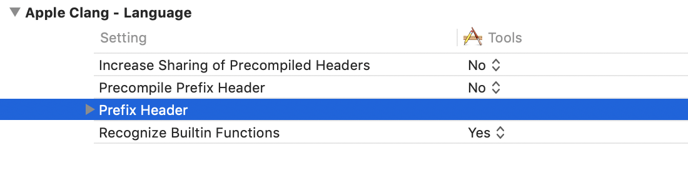
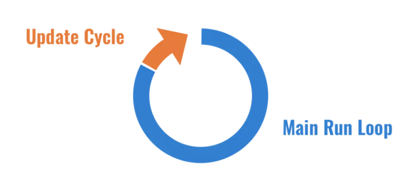

# UI进阶

## LaunchScreen.storyboard

设置LaunchScreen之后在程序中打印NSHomeDirectory()然后在前往打印出来的文件夹，可以在里面的library/cache/snapshots中找到相应的LaunchScreen的图片，包括横向合竖屏的。
如果不使用LaunchScreen可以在target中设置LaunchScreenFile为空，并且可以设置Launch Image Source之后在Assets里直接放置对应尺寸的图片。

## info.plist

可以open as sourceCode已源代码的形式打开，打开之后是XML文件，key-value对应。

## .pch

.pch文件，通常用于定义一些公用宏 + 公共头文件。并且通常以工程名来命名。还要配置路径在target/build setting搜索prefix 然后在clang中的prefix header中修改当前路径为pch文件路径（注意不能带中文）$(SRCROOT)/项目名/Prefix.pch



而它的**原理**是将文件内定义的拷贝到工程每一个文件中（代价很高）

注意 **在OC C混编的时候要判断文件中是否有__OBJC__这个宏来判断时候是OC文件**

## UIApplication

每个APP都有一个UIApplicaiotn的实例或者他的subclass（如果你必须要在系统执行之前处理传入的事件，才需要自定义subclass），When an app is launched, the system calls the UIApplicationMain function; among its other tasks, **this function creates a Singleton UIApplication object**. Thereafter you access the object by calling the **sharedApplication** class method.通过UIApplication创建一个单例的UIApplication对象，并且能通过sharedApplication获取这个单例。

A major role of your app’s application object is to handle the initial routing of incoming user events. It dispatches action messages forwarded to it by control objects (instances of the UIControl class) to appropriate target objects. The application object maintains a list of open windows (UIWindow objects) and through those can retrieve any of the app’s UIView objects.

UIApplication对象主要的作用是处理传入的用户事件的initial routing，他通过UIControl的实例将动作消息分发给适合的目标对象。UIApplicaiotn单例维护着一个UIWindow对象列表，通过这个可以检索任意app内的UIView的对象

### UIApplicationMain函数

`UIApplicationMain(argc, argv, nil, NSStringFromClass([AppDelegate class]))`
第三个参数：The name of the UIApplication class or subclass. If you specify nil, UIApplication is assumed.
第四个参数：The name of the class from which the application delegate is instantiated. **If principalClassName designates a subclass of UIApplication, you may designate the subclass as the delegate**如果有UIApplication子类即上面第三个参数有指定的话，可以也设定他为代理（要记得添加UIWindow属性）

> It also sets up the main event loop, including the application’s run loop, and begins processing events. 设置主要的事件循环也包括runloop，并处理事件。

1. 设置icon
   1. 设置属性`applicationIconBadgeNumber`
2. 设置联网状态
   1. showing network spinning gear in status bar
   2. 属性`networkActivityIndicatorVisible`
3. 设置状态栏
   1. iOS中每个VC都可以有一个自己的状态栏
      1. 样式`- (UIStatusBarStyle)preferredStatusBarStyle {return UIStatusBarStyleLightContent;}`
      2. 是否隐藏`- (BOOL)prefersStatusBarHidden {return YES;}`
   2. UIApplication中则是通过属性设置还要修改info.plist`View controller-based status bar appearance`
      1. 如果是为YES则VC生效
      2. NO的话VC失效 Application生效
4. 打开URL
   1. `- (void)openURL:(NSURL*)url options:(NSDictionary<UIApplicationOpenExternalURLOptionsKey, id> *)options completionHandler:(void (^ __nullable)(BOOL success))completion NS_AVAILABLE_IOS(10_0) NS_EXTENSION_UNAVAILABLE_IOS("");`详细见系统

### UIApplication的delegate

* 移动端的APP会很容易收到外界的干扰（锁屏，后台），会导致APP进入后台甚至终止
收到这些状况的时候UIApplication会通知它的代理对象（生命周期过程、内存警告、系统事件）,系统已经在main函数中默认将`NSStringFromClass([ZTApplication class])`设置为UIApplication代理

```objc
- (BOOL)application:(UIApplication *)application didFinishLaunchingWithOptions:(NSDictionary *)launchOptions {
    // 程序启动完毕的时候调用
    return YES;
}
- (void)applicationWillResignActive:(UIApplication *)application {
    // 程序失去焦点的时候调用
}
- (void)applicationDidEnterBackground:(UIApplication *)application {
    // 程序进入到后台的时候调用
}
- (void)applicationWillEnterForeground:(UIApplication *)application {
   //  程序进入前台的时候调用
}
- (void)applicationDidBecomeActive:(UIApplication *)application {
    // 程序获取焦点的时候调用
}
- (void)applicationWillTerminate:(UIApplication *)application {
    // 程序终止的时候
}
- (void)applicationDidReceiveMemoryWarning:(UIApplication *)application {
    // 程序收到内存警告
}
- (BOOL)application:(UIApplication *)app openURL:(NSURL *)url options:(NSDictionary<UIApplicationOpenURLOptionsKey, id> *)options {
    return YES|NO; // 返回一个BOOl是否可以处理一个URL scheme
}
```

### UIApplication还可以做什么

* Temporarily suspend incoming touch events (`beginIgnoringInteractionEvents`)暂时挂起到来的触碰事件
* Register for remote notifications (`registerForRemoteNotifications`)注册远程通知
* Trigger the undo-redo UI (`applicationSupportsShakeToEdit`)触发undo-redo的UI
* Determine whether there is an installed app registered to handle a URL scheme (`canOpenURL:`)返回一个BOOl是否可以处理一个URL scheme
* Extend the execution of the app so that it can finish a task in the background(`beginBackgroundTaskWithExpirationHandler:, beginBackgroundTaskWithName:expirationHandler:`)扩展应用程序的执行，以便它可以在后台完成任务
* Schedule and cancel local notifications (`scheduleLocalNotification:, cancelLocalNotification:`)安排取消本地通知
* Coordinate the reception of remote-control events (`beginReceivingRemoteControlEvents, endReceivingRemoteControlEvents`)协调远程控制事件的接受
* Perform app-level state restoration tasks (methods in the Managing the State Restoration Behavior task group)执行应用级状态恢复任务

## UIWindow

UIWindow是一个特殊的View，每个App都有一个Window，它也是app创建的第一个视图控件，接着创建控制器的View并且**添加**到UIWindow上，没有UIWindow的话就没有任何的控件显示（If your app does not use storyboards, you must create this window yourself.）用了storyboards的话系统会自动帮你创建keyWindow

### 不通过storybroad加载

不使用main.storybroad直接加载vc的话可以直接在AppDeleagate中UIApplication的回调didFinishLaunch中声明UIWindow并自己设置启动方式

```objc
self.window = [[UIWindow alloc] init];
ViewController *rootVC = [[ViewController alloc] init];
self.window.rootViewController = rootVC;// 必要一个root
self.window.windowLevel = UIWindowLevelNormal; //UIWindow可以设置level UIWindowLevelAlert > UIWindowLevelStatusBar状态栏 > UIWindowLevelNormal
[self.window makeKeyAndVisible];
/*
convenience. most apps call this to show the main window and also make it key. otherwise use view hidden property 将window的hidden属性设置为NO 设置当前window为UIApplication的keyWindow
*/
```

### 手动加载storybroad中的vc

```objc
self.window = [[UIWindow alloc] init];
UIStoryboard *storyboard = [UIStoryboard storyboardWithName:@"Main" bundle:nil];/*storyboardBundleOrNil*/
UIViewController *root = storyboard.instantiateInitialViewController;
self.window.rootViewController = root;
[self.window makeKeyAndVisible];
```

⚠️：通过storyborad加载之后会调用initWithCoder将他解码，然后再调用`awakeFromNib`

## UIViewController

## UINavigationController


1. UILayoutContainerView
   1. UINavigationTransitionView // 栈顶显示view
   2. UINavigationBar // 导航栏

要修改每个VC的bar要使用`navigationItem`来更改，一旦修改来leftbutton那么navigation自带的侧滑会失效，需要手势
⚠️最好设定一个颜色，如果是clearcolor会卡一下

navigation中pop的vc没有释放 1. 网络请求没有结束 2. 计时器没有被invalidate 3.有强引用(比如viewController是的一个未释放的viewController的属性)

## UIResponder

UIResponder**用于响应和处理事件的抽象接口**
很多对象都是**继承自UIResponder**包括UIApplication UIView UIViewController 甚至是UIWindow，当一个事件发生当时候，UIKit会将他分发给响应者去解决。除了解决这些事件（点击事件，按压事件，远程控制事件等），UIResponder还要管理未处理的事件将它转发给app的其他部分，如果给定的响应者没有处理事件，它会将该事件转发到响应者链中的下一个事件

### UITouch

* An object representing the location, size, movement, and force of a touch occurring on the screen.
* 当手指移动时，系统会更新同一个UITouch对象，使之能够一直保存该手指在的触摸位置
* 当手指离开屏幕时，系统会销毁相应的UITouch对象
提 示:iPhone开发中，要避免使用双击事件！

```objc
- (void)touchesMoved:(NSSet *)touches withEvent:(UIEvent *)event {
    // 想让控件随着手指移动而移动,监听手指移动
    // 获取UITouch对象
    UITouch *touch = [touches anyObject];
    // 获取当前点的位置
    CGPoint curP = [touch locationInView:self];
    // 获取上一个点的位置
    CGPoint preP = [touch previousLocationInView:self];
    // 获取它们x轴的偏移量,每次都是相对上一次
    CGFloat offsetX = curP.x - preP.x;
    // 获取y轴的偏移量
    CGFloat offsetY = curP.y - preP.y;
    // 修改控件的形变或者frame,center,就可以控制控件的位置
    // 形变也是相对上一次形变(平移)
    // CGAffineTransformMakeTranslation:会把之前形变给清空,重新开始设置形变参数
    // make:相对于最原始的位置形变
    // CGAffineTransform t:相对这个t的形变的基础上再去形变
    // 如果相对哪个形变再次形变,就传入它的形变
    self.transform = CGAffineTransformTranslate(self.transform, offsetX, offsetY);
}
```

### 事件的产生和传递

1. 生成事件
   1. 当用户点击屏幕的时候会产生一个触摸事件然后硬件会将这个事件通过进程间的通讯传递给APP。
   2. 这个触摸事件又会被封装成UIEvent然后放进UIApplication管理的event queue中。
   3. 等到从队列中取出事件，交给最上层的UIWindow处理（hit-Testing）。
2. 查找第一响应者
   1. Window收到事件后会在视图层次结构中找到最适合的一个视图来处理事件
   2. 通常一个窗口中最适合处理当前事件的对象称为第一响应对象。
   3. 这是一个自顶向下的过程知道找到最适合的，**如果一个super控件不能处理事件，sub控件也不能**

### 事件的响应

   1. 调用touchBegin……来处理事件 里面的默认[super touchBegin:]就是交给父类来处理这个事件
   2. 通常是firstResponder来**处理事件**，如果第一响应对象**无法处理事件**，那么就会**把事件传递给上一个响应对象**，直到Application。如果Application也无法处理，那就丢**弃掉**此事件。
   3. 在上述系列操作中，所参与到的UIApplication、UIViewController和UIView就作为响应对象构成这次事件的响应链。view -> ViewController -> window -> Application -> 丢弃

在我们需要使用键盘的时候，经常使用[self.textField registerFirstResponder]组册成为第一响应者，但是其实是Application.keyWindow.vc通过hitTest:withEvent找到事件最合适的响应者，再让[self becomeFirstResponder]唤起键盘

整体的方法一个是从顶向下一个是自低向上的过程，先根据响应链进行时间的传递再进行事件的响应。

### 响应链中的方法
<!-- 找到最适合的响应者 -->
```objc
// 因为所有的视图类都是继承BaseView
- (UIView *)hitTest:(CGPoint)point withEvent:(UIEvent *)event {
// 1.判断当前控件能否接收事件 （UIImageView的userInteration默认为NO）
   if (!self.userInteractionEnabled || self.isHidden || self.alpha <= 0.01) return nil;
// 2. 判断点在不在当前控件
   if (![self pointInside:point withEvent:event]) return nil;
// 3.从后往前遍历自己的子控件 看子控件能否处理事件
  for (UIView *childView in self.subviews) {
        CGPoint childPoint = [self convertPoint:point toView:childView];
        UIView *fitView = [childView hitTest:childPoint withEvent:event];
        if (fitView)
            return fitView;
    }
    return self;
   // 循环结束,表示没有比自己更合适的view
}
```
<!-- 扩大按钮的点击范围 CGRectInset-->
<!-- 当子View超出父View的情况 在superView中的pointInside遍历subView的frame-->
<!-- 如果一个Button被一个View盖住了，在触摸View时，希望该Button能够响应事件 -->
```objc
- (BOOL)pointInside:(CGPoint)point withEvent:(UIEvent*)event {
    CGRect bounds = self.bounds;
    bounds = CGRectInset(bounds, -10, -10);
   // CGRectContainsPoint  判断点是否在矩形内⚠️⚠️⚠️
    return CGRectContainsPoint(bounds, point);
}
```

### UIEvent

#### 响应方法

##### touch事件（触摸事件）

最常见的就是touch事件（⚠️在UIViewController中重写方法，是UIViewController作为responder而不是vc.view）

```objc
- (void)touchesBegan:(NSSet<UITouch *> *)touches withEvent:(UIEvent *)event {
    // touchEnd touchCancel touchMoved 传入UItouch
}
```

##### motion事件

```objc
- (void)motionBegan:(UIEventSubtype)motion withEvent:(UIEvent *)event {
    // 加速器事件 摇一摇
}
```

##### remote-control事件

```objc
- (void)remoteControlReceivedWithEvent:(UIEvent *)event {
    // 远程控制事件 耳机线控（蓝牙是另一套机制）
}
```

##### press事件

```objc
- (void)pressesEnded:(NSSet<UIPress *> *)presses withEvent:(UIPressesEvent *)event {
    // 按压事件
}
```

## UIGestureRecognizer

UIGestureRecognizer和响应链的关系
**手势响应是大哥**，**点击事件响应链是小弟**。单击手势优先于UIView的事件响应。大部分冲突，都是因为优先级没有搞清楚。
单击事件优先传递给手势响应大哥，在一个手势触发之前，是会一并发消息给事件传递链的，所以才会有最开始的touchMoved方法被调用，当识别出手势以后，就会终止touch事件的传递

### UIGestureRecognizer的几个subClass

子类才是UIGetsrureRecognizer的关键

1. `UITapGestureRecognizer` 点击手势
2. `UISwipeGestureRecognizer` 滑动手势
   1. 一个滑动手势对应一个`direction` 默认向右
3. `UIScreenEdgePanGestureRecognizer` 边缘平移手势
4. `UILongPressGestureRecognizer` 长按手势 // 长按手指移动的会持续调
5. 连续手势 （都是基于原始的变换通过transform来变换，需要set来清零）
   1. `UIPanGestureRecognizer` 平移手势
      1. 获取移动的`translationInView`
   2. `UIPinchGestureRecognizer` 捏合手势
      1. 捏合的scale的大小 原始大小为1
      2. 捏合的速度velocity
   3. `UIRotationGestureRecognizer` 旋转手势
      1. rotation旋转的角度（弧度）相对于原始的变换
      2. 旋转的速度velocity

### 关键方法

```objc
//初始化方法 且 添加 target的方法
- (instancetype)initWithTarget:(nullable id)target action:(nullable SEL)action
//单独添加target的方法
- (void)addTarget:(id)target action:(SEL)action;
//移除target的方法
- (void)removeTarget:(nullable id)target action:(nullable SEL)action;
```

> 一个手势对象可以添加多个`selector`，并且一次都会被触发

### 属性

```objc
// 手势的状态
@property(nonatomic,readonly) UIGestureRecognizerState state;  
// 手势代理
@property(nullable,nonatomic,weak) id <UIGestureRecognizerDelegate> delegate;
// 手势是否有效  默认YES
@property(nonatomic, getter=isEnabled) BOOL enabled;
// 获取手势所在的view
@property(nullable, nonatomic,readonly) UIView *view;
// 取消view上面的touch事件响应  default  YES  
@property(nonatomic) BOOL cancelsTouchesInView;
// 延迟touch事件开始 default  NO 如果为YES在失败之前都不会给响应链发消息
@property(nonatomic) BOOL delaysTouchesBegan;
// 延迟touch事件结束 default  YES 是否等待一段事件向touchEnd发送消息
@property(nonatomic) BOOL delaysTouchesEnded;
// 允许touch的类型数组
@property(nonatomic, copy) NSArray<NSNumber *> *allowedTouchTypes
// 允许按压press的类型数组
@property(nonatomic, copy) NSArray<NSNumber *> *allowedPressTypes
// 是否只允许一种touchType 类型 默认为YES IPAD同时只允许一种触控（笔|手）
@property (nonatomic) BOOL requiresExclusiveTouchType
// 手势依赖（手势互斥）方法
- (void)requireGestureRecognizerToFail:(UIGestureRecognizer *)otherGestureRecognizer;
// 获取在传入view的点击位置的信息方法
- (CGPoint)locationInView:(nullable UIView*)view;
// 获取触摸点数
@property(nonatomic, readonly) NSUInteger numberOfTouches;
//（touchIndex 是第几个触摸点）用来获取多触摸点在view上位置信息的方法
- (CGPoint)locationOfTouch:(NSUInteger)touchIndex inView:(nullable UIView*)view;
// 给手势加一个名字，以方便调式（iOS11 or later可以用）
@property (nullable, nonatomic, copy) NSString *name API_AVAILABLE(ios(11.0)
```

#### UIGestureRecognizerDelegate

```objc
// 开始进行手势识别时调用的方法，返回NO，则手势识别失败
- (BOOL)gestureRecognizerShouldBegin:(UIGestureRecognizer *)gestureRecognizer;
// 是否支持同时多个手势触发
//**返回YES，则可以多个手势一起触发方法，返回NO则为互斥**
- (BOOL)gestureRecognizer:(UIGestureRecognizer *)gestureRecognizer shouldRecognizeSimultaneouslyWithGestureRecognizer:(UIGestureRecognizer *)otherGestureRecognizer;
// 下面这个两个方法也是用来控制手势的互斥执行的
//这个方法返回YES，第二个手势的优先级高于第一个手势
- (BOOL)gestureRecognizer:(UIGestureRecognizer *)gestureRecognizer shouldRequireFailureOfGestureRecognizer:(UIGestureRecognizer *)otherGestureRecognizer NS_AVAILABLE_IOS(7_0);
// 这个方法返回YES，第一个手势的优先级高于第二个手势
- (BOOL)gestureRecognizer:(UIGestureRecognizer *)gestureRecognizer shouldBeRequiredToFailByGestureRecognizer:(UIGestureRecognizer *)otherGestureRecognizer NS_AVAILABLE_IOS(7_0);
// 在touchBegin之前被调用 return NO 手势解析器不接受不接受
- (BOOL)gestureRecognizer:(UIGestureRecognizer *)gestureRecognizer shouldReceiveTouch:(UITouch *)touch;
```

### UIGestureRecognizer的状态机

UIGestureRecognizer状态默认是possible

**非连续的手势**要么识别成功(UIGestureRecognizerStateRecognized)，要么识别失败(UIGestureRecognizerStateFailed)。

**连续的手势**识别到第一个手势时，变成UIGestureRecognizerStateBegan，然后变成UIGestureRecognizerStateChanged，并且不断地在这个状态下循环，当用户最后一个手指离开view时，变成UIGestureRecognizerStateEnded，

当然如果手势不再符合它的模式的时候，状态也可能变成UIGestureRecognizerStateCancelled。

### UIGestureRecognizer和UIControl

UIControl，他的subclass`UIButton``UISwitch`等系统提供的默认有action的响应优先级比手势识别器高,而**对于自定义的UIControl，响应的优先级比手势低**。由于UIControl也是继承自UIView即UIResponder也是有touch方法的

```objc
- (BOOL)beginTrackingWithTouch:(UITouch *)touch withEvent:(nullable UIEvent *)event;
- (BOOL)continueTrackingWithTouch:(UITouch *)touch withEvent:(nullable UIEvent *)event;
- (void)endTrackingWithTouch:(nullable UITouch *)touch withEvent:(nullable UIEvent *)event;
- (void)cancelTrackingWithEvent:(nullable UIEvent *)event;
```

> UIControl确实是有自己独特的方法，但是UIControl只能接受一个UITouch单点触控。UIControl也有touch事件，但是和默认的不同的是他在`touch`方法中调用了自己的`tracking`方法

* 当`UIControl track`事件的过程中，识别出事件交互符合响应条件，会触发target-action进行响应。当事件发生时，UIControl通知target执行对应的action。事实上这里有个action传递的过程。当UIControl监听到需要处理的交互事件时，会调用 `sendAction:to:forEvent:`将`target`、`action`以及`event`对象发送给全局应用，`Application`对象再通过 `sendAction:to:from:forEvent:`向`target`发送`action`。

## 抛出异常

```objc
    NSException *ex = [NSException exceptionWithName:@"exceptionName" reason:@"exception reason" userInfo:nil];
    [ex raise];
```

## UIView和CALayer

[链接：https://www.jianshu.com/p/fd8cd2231541](https://www.jianshu.com/p/fd8cd2231541)

UIView继承自UIResponder可以响应事件，但是CALayer直接继承自NSObject不能响应。
UIView相当于CALayer的delegate，负责处理事件，而CALayer负责绘制。简单的就是MVC中的**View和Controller**的关系
**每个 UIView 内部都有一个 CALayer 在背后提供内容的绘制和显示**，并且 UIView 的尺寸样式都由内部的 Layer 所提供。两者都有树状层级结构，**layer 内部有 SubLayers，View 内部有 SubViews**.但是 Layer 比 View 多了个AnchorPoint

### 计算机中CPU和GPU的关系


计算机系统中 CPU、GPU、显示器是协同工作的。CPU 计算好显示内容提交到 GPU，GPU 渲染完成后将渲染结果放入帧缓冲区，随后视频控制器会按照 VSync 信号逐行读取帧缓冲区的数据，经过可能的数模转换传递给显示器显示。

### 为什么会造成卡顿


在 VSync 信号到来后，系统图形服务会通过 CADisplayLink 等机制通知 App，**App 主线程开始在 CPU 中计算显示内容**，比如视图的创建、布局计算、图片解码、文本绘制等。**随后 CPU 会将计算好的内容提交到 GPU 去**，**由 GPU 进行变换、合成、渲染。随后 GPU 会把渲染结果提交到帧缓冲区去，等待下一次 VSync 信号到来时显示到屏幕上**。**由于垂直同步的机制，如果在一个 VSync 时间内，CPU 或者 GPU 没有完成内容提交，则那一帧就会被丢弃**，等待下一次机会再显示，而这时显示屏会保留之前的内容不变。这就是界面卡顿的原因。
CPU 和 GPU 不论哪个阻碍了显示流程，都会造成掉帧现象。所以开发时，也需要分别对 CPU 和 GPU 压力进行评估和优化。

#### GPU

相对于 CPU 来说，GPU 能干的事情比较单一：接收提交的纹理（Texture）和顶点描述（三角形），应用变换（transform）、混合并渲染，然后输出到屏幕上。通常你所能看到的内容，主要也就是纹理（图片）和形状（三角模拟的矢量图形）两类。

**纹理的渲染**
所有的 Bitmap，包括图片、文本、栅格化的内容，最终都要由内存提交到显存，绑定为 GPU Texture。不论是提交到显存的过程，还是 GPU 调整和渲染 Texture 的过程，都要消耗不少 GPU 资源。当在较短时间显示大量图片时（比如 TableView 存在非常多的图片并且快速滑动时），CPU 占用率很低，GPU 占用非常高，界面仍然会掉帧。避免这种情况的方法只能是尽量减少在短时间内大量图片的显示，尽可能将多张图片合成为一张进行显示。
当图片过大，超过 GPU 的最大纹理尺寸时，图片需要先由 CPU 进行预处理，这对 CPU 和 GPU 都会带来额外的资源消耗。

**视图的混合** (Composing)
当多个视图（或者说 CALayer）重叠在一起显示时，GPU 会首先把他们混合到一起。如果视图结构过于复杂，混合的过程也会消耗很多 GPU 资源。为了减轻这种情况的 GPU 消耗，应用应当尽量减少视图数量和层次，并在不透明的视图里标明 opaque 属性以避免无用的 Alpha 通道合成。当然，这也可以用上面的方法，把多个视图预先渲染为一张图片来显示。

**图形的生成**
CALayer 的 border、圆角、阴影、遮罩（mask），CASharpLayer 的矢量图形显示，通常会触发离屏渲染（**offscreen rendering 指的是在GPU在当前屏幕缓冲区以外开辟一个缓冲区进行渲染操作 首选要创建一个新的缓冲区，屏幕渲染会有一个上下文环境的一个概念，离屏渲染的整个过程需要切换上下文环境，先从当前显示幕切换到离屏，等结束后，又要将上下文环境切换回来。这也是为什么会消耗性能的原因**），而离屏渲染通常发生在 GPU 中。当一个列表视图中出现大量圆角的 CALayer，并且快速滑动时，可以观察到 GPU 资源已经占满，而 CPU 资源消耗很少。这时界面仍然能正常滑动，但平均帧数会降到很低。为了避免这种情况，可以尝试开启 CALayer.shouldRasterize 属性，但这会把原本离屏渲染的操作转嫁到 CPU 上去。对于只需要圆角的某些场合，也可以用一张已经绘制好的圆角图片覆盖到原本视图上面来模拟相同的视觉效果。最彻底的解决办法，就是把需要显示的图形在后台线程绘制为图片，避免使用圆角、阴影、遮罩等属性

## - (void)loadView

* 每个controller默认有一个loadView方法，被暴露在外面（系统会调用这个方法来创建controller的view，在第一次使用View的时候懒加载）Instantiates a view from a nib file and sets the value of the view property.

> 系统**默认**怎么加载控制器的view呢，先在storyboard里面找，没有找到再去找与控制器同名的xib,没有找到，在去名称相同Controller的xib里面找去找
> 还没有找到，也没有重写loadView方法，那么系统默认会创建一个view，颜色是clearColor,
> 如果实现了loadView方法的话，上面的都不会做使用`[super loadView]`也不行

* 在什么时候自定义loadView
  * 当控制器的View一进来就是一张图片的时候
  * 控制器一进来就加载图片的时候

> 下一个方法是ViewDidLoad Called after the view controller’s view has been loaded into memory.

## UIView

### UIView的transform属性

Transformations occur relative(相对) to the view's anchor point（锚点）. By default, the anchor point is equal to the center point of the frame rectangle. To change the anchor point, modify the anchorPoint property of the view's underlying CALayer object.（要改变view的锚点要修改CALayer的anchorPoint属性）

```objc
view.transform = CGAffineTransformMakeTranslation(10, 20);// 平移一次
//   CGAffineTransformTranslate(CGAffineTransform t, 10, 20); 相对于一个transform开始形变做多次形变
//   CGAffineTransformMakeRotation(M_PI);// 旋转弧度M_PI
//   CGAffineTransformMakeScale(1, 1) // 缩放scale 1是原始大小 放大 >1< 缩小
//   CGAffineTransformIdentity;原始状态 还原
```

### 2种transform结合

`CGAffineTransformConcat(transform A, transform B)`

⚠️When the value of this property is anything other than the identity transform（不是默认值Identity）, the value in the frame property is undefined and should be ignored.（这个view的frame应该被忽略）

### CGAffineTransform(仿射变换)

仿射变换其实是另外两种简单变换的叠加：一个是线性变换，一个是平移变换。本质其实是线性代数中的仿射变换矩阵得来的。**以后有机会研究**
`CGAffineTransformMake(CGFloat a, CGFloat b, CGFloat c, CGFloat d, CGFloat tx, CGFloat ty)`


第三列始终是 0 0 1

### Quartz2D

Allow users to browse, edit, and save images, using slideshows and Core Image filters.
二维绘图引擎（绘制图形、绘制文字、绘制/生成图片、读取生成PDF、**裁剪图片**、**自定义控件**）

#### 图形上下文（Graphics Context）CGContextRef

1. 图形上下文的作用
   1. 保存绘图信息，绘图形状
   2. 决定绘制的输出目标
绘制好的图形--保存-->图形上下文--显示-->输出目标

##### 上下文种类

Bitmap Graphics Context
PDF Graphics Context
Window Graphics Context
Layer Graphics Context (UIView Layer上下文)

#### 自定义UIView`- (void)drawRect:(NSRect)rect`

```objc
// Only override drawRect: if you perform custom drawing.
// An empty implementation adversely affects performance during animation.
- (void)drawRect:(CGRect)rect {
    // Drawing code
    NSLog(@"%s",__func__);
    // 获取当前和view相关联的上下文
    CGContextRef contextRef = UIGraphicsGetCurrentContext();
    // 贝塞尔曲线
    UIBezierPath *path = [UIBezierPath bezierPath];
    // 移动到起点
    [path moveToPoint:CGPointZero];
    // 添加一个线到某个点
    [path addLineToPoint:CGPointMake(240, 240)];
    // 把path添加到上下文 将path->CGPath
    CGContextAddPath(contextRef, path.CGPath);
    // 最后渲染上下文layer上 1. stroke 2. fill
    CGContextStrokePath(contextRef);
}
```

在`viewWillAppear`和`ViewDidAppear`中间调用
传入的是当前view的`bounds`

* 获取当前view的上下文`CGContextRef contextRef = UIGraphicsGetCurrentContext();`
* 系统调用`drawRect`方法的时候才会创建上下文(自己调用的是没有的)
  * 可以调用`setNeedsDisplay`，它是异步执行的，会自动调用`drawRect`方法，这样可以拿到 `CurrentContext()`
    * 在屏幕刷新的时候去调用这个方法

#### - (void)setNeedsDisplay{}

**Marks(标记) the receiver’s entire(整个) bounds rectangle as needing to be redrawn.**

You can use this method or the `setNeedsDisplayInRect:` to notify(通知) the system that your view’s contents(内容) need to be redrawn. This method makes a note of the request and returns immediately. The view is not actually redrawn until the next drawing cycle(视图不会马上更新直到下一个绘制周期), at which point all invalidated views are updated.

You should use this method to request that a view be redrawn **only when the content or appearance of the view change**. If you simply change the geometry of the view, the view is typically not redrawn. Instead, its existing content is adjusted based on the value in the view’s `contentMode property`(UIViewContentModeScaleToFill|UIViewContentModeScaleAspectFit……). Redisplaying the existing content improves performance by avoiding the need to redraw content that has not changed.

**notes**: If your view is backed by a CAEAGLLayer(A layer that supports drawing OpenGL content in iOS applications.) object, this method has **no effect**. It is intended for use only with views that use native drawing technologies (such as UIKit and Core Graphics) to render(呈现) their content.

#### UIBezierPath 贝塞尔曲线

`[path stroke] [path fill]` 可以简单实现获取上下文的操作

##### 画几何图形

`UIBezierPath *path = [UIBezierPath bezierPathWithRect:CGRectMake(x, y, width, height)];`
再通过fill或者stroke绘制简答图形

##### 绘制弧线

`+ (instancetype)bezierPathWithArcCenter:(CGPoint)center radius:(CGFloat)radius startAngle:(CGFloat)startAngle endAngle:(CGFloat)endAngle clockwise:(BOOL)clockwise;`

0度是⭕️的右侧向上为负向下为负 M_PI为宏定义

##### 绘制文字

`[@"周天荣" drawAtPoint:CGPointMake(rect.size.width * 0.5, rect.size.height * 0.5) withAttributes:nil];`

* 文字的对象
* 文字的位置
* 文字设置的Attributes Dictionary
  * `NSFontAttributeName` 文字的字体UIFont对象
  * `NSForegroundColorAttributeName` 文字的颜色
  * `NSStrokeColorAttributeName` 文字描边颜色
  * `NSStrokeWidthAttributeName` 文字描边宽度
  * `NSShadowAttributeName` 设置NSShadow的对象
    * shadowOffset shadowBlurRadius(模糊阴影半径) shadowColor

##### View中的定时器

```objc
    // 每次屏幕刷新的时候更新 fps60 流畅
    CADisplayLink *link = [CADisplayLink displayLinkWithTarget:self selector:@selector(startDisplay)];
    [link addToRunLoop:[NSRunLoop mainRunLoop] forMode:NSRunLoopCommonModes];// 添加到runloop到common模式中
```

##### 上下文状态栈

有一个存放的路径 和存放状态

##### 形变CTM

### UIView中的几个重要方法

#### Update Cycle

**Update cycle** 是当应用完成了你的所有事件处理代码后控制流回到主 RunLoop 时的那个时间点。正是在这个时间点上系统开始更新布局、显示和设置约束。如果你在处理事件的代码中请求修改了一个 view，那么系统就会把这个 view 标记为需要重画（redraw）。在接下来的 Update cycle 中，系统就会执行这些 view 上的更改



#### `- (void)setNeedsLayout{}`

**Invalidates（无效化） the current layout of the receiver and triggers(触发) a layout update during the next update cycle.**

Call this method on your application’s main thread when you want to **adjust the layout of a view’s subviews**. This method makes a note of the request and returns immediately. Because this method does not force an immediate update, but instead waits for the next update cycle, you can use it to invalidate the layout of multiple views before any of those views are updated. This behavior allows you to consolidate(合并) all of your layout updates to one update cycle, which is usually better for performance(性能).

触发 `layoutSubviews` 调用的最省资源的方法就是在你的视图上调用 `setNeedsLaylout` 方法。调用这个方法代表向系统表示视图的布局需要重新计算。`setNeedsLayout` 方法会立刻执行并返回，但在返回前不会真正更新视图。视图会在下一个 `update cycle` 中更新，就在系统调用视图们的 `layoutSubviews` 以及他们的所有子视图的 layoutSubviews 方法的时候。

#### `- (void)layoutIfNeeded{}`

**Lays out the subviews immediately, if layout updates are pending(如果布局更新处于待处理状态).**

Use this method to force(强制) the view to update its layout immediately. When using Auto Layout, the layout engine updates the position of views as needed to satisfy changes in constraints. Using the view that receives the message as the root view, this method lays out the view subtree starting at the root. If no layout updates are pending, this method exits without modifying the layout or calling any layout-related callbacks.

#### `- (void)layoutSubviews{}`

**Lays out subviews.**

The default implementation of this method does nothing on iOS 5.1 and earlier. Otherwise, the default implementation uses any constraints you have set to determine the size and position of any subviews.

Subclasses can override this method as needed to perform more precise layout of their subviews. You should override this method only if the autoresizing and constraint-based behaviors of the subviews do not offer the behavior you want. You can use your implementation to set the frame rectangles of your subviews directly.

You should not call this method directly. If you want to force a layout update, call the setNeedsLayout method instead to do so prior to the next drawing update. If you want to update the layout of your views immediately, call the layoutIfNeeded method.

* 修改 view 的大小
* 新增 subview
* 用户在 UIScrollView 上滚动（layoutSubviews 会在 UIScrollView 和它的父 view 上被调用）
* 用户旋转设备
* 更新视图的 constraints

`layoutSubViews`**这个方法很开销很大，因为它会在每个子视图上起作用并且调用它们相应的 `layoutSubviews`方法**，所以最好不要显示的调用这个方法。相反，有许多可以在 run loop 的不同时间点触发 layoutSubviews 调用的机制，这些触发机制比直接调用 layoutSubviews 的资源消耗要小得多。

##### `- (void)viewDidLayoutSubviews`

在`layoutSubViews`完成之后之后，view所属vc会调用这个方法，`viewDidLayoutSubviews` 是 view 布局更新后会被唯一可靠调用的方法，所以你应该把所有依赖于布局或者大小的代码放在 `viewDidLayoutSubviews` 中，而不是放在 `viewDidLoad` 或者 `viewDidAppear` 中

#### `- (void)updateConstraints`

#### `- (void)setNeedsUpdateConstraints`

#### `- (void)updateConstraintsIfNeeded`

#### `invalidateIntrinsicContentSize`

#### layout && constraint && draw
